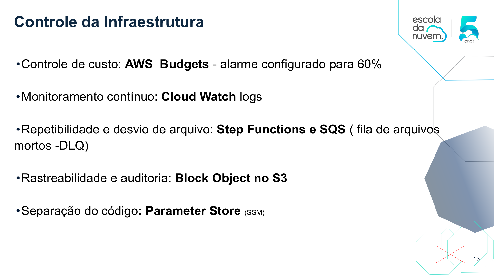

# ARIA | Inteligência Regulatória com IA Generativa 🚀
🥈 **2º LUGAR GERAL** no Hackathon Talento Tech 3.0 - Escola da Nuvem - Hacking for Good 2026.

  **Solução: "Extração de Conhecimento em Dados Complexos"**

---

## 🌟 Visão Geral do Projeto

  

A ARIA, anteriormente conhecida como PharmaGen Insights, é uma plataforma de Inteligência Regulatória muito avançada. Ela ajuda a automatizar todo o processo de documentos técnicos. Isso inclui desde a leitura e interpretação dos documentos até o acompanhamento constante de regras e publicações científicas. Com isso, a ARIA transforma informações que antes estavam paradas em uma espécie de “cérebro” da empresa, que está sempre atualizado e pode ser consultado quando necessário.

Nascida no **Hackathon Talento Tech 3.0** Escola da Nuvem 2026, a solução resolve o gargalo da leitura manual de milhares de páginas de editais, ensaios clínicos e resoluções, eliminando altos custos operacionais e riscos críticos de não conformidade.

### 👤 O Desafio do Setor (Persona)
"A indústria farmacêutica trabalha com uma grande quantidade de documentos complexos. Sem automação, as decisões ficam mais lentas e há riscos de multas e sanções por erros na interpretação das normas."

### 💡 Transformação na Prática

  

*   **Cenário Tradicional:** Analistas dedicam ~15h semanais à leitura manual de atualizações da ANVISA/FDA para evitar sanções.
*   **Cenário com ARIA:** O sistema realiza a busca ativa e o processamento autônomo. O analista recebe um **Relatório Estratégico** com impactos diretos, permitindo foco total em inovação e segurança.

---

## 🚀 Diferenciais Estratégicos e Técnicos

A ARIA utiliza um pipeline inteligente que garante **rastreabilidade total** e **escalabilidade**:

1.  **RAG (Retrieval-Augmented Generation):** Respostas fundamentadas estritamente nos documentos carregados, com citação direta de **fonte, página e parágrafo**, essencial para auditorias.
2.  **Ingestão Híbrida:** 
    *   **Reativa (Manual):** Upload de PDFs (estudos, dossiês) via portal.
    *   **Proativa (Autônoma):** Busca ativa via API/Crawler em órgãos reguladores (Amazon EventBridge).
3.  **Extração Especializada:** Integração de **Amazon Textract** com **Comprehend Medical** para identificar entidades clínicas (dosagens, princípios ativos) e relações médicas complexas.
4.  **Human-in-the-Loop:** Fluxos de aprovação integrados para que informações críticas sejam validadas por especialistas antes da indexação final.

---

## 🏗️ Arquitetura Cloud Native (AWS)

  

Desenhada sob os pilares do **AWS Well-Architected Framework**, garantindo integridade regulatória:

*   **Armazenamento Inteligente:** Camadas de dados no **Amazon S3** (Raw, Processed, Archive) com políticas de Lifecycle, Versionamento e **Object Lock**.
*   **Orquestração de Fluxo:** Gerenciada pelo **AWS Step Functions**, tratando ramificações críticas e erros via **Amazon SQS**.
*   **Núcleo de IA:** **Amazon Bedrock** (Claude 3 Haiku) para geração contextual, integrado ao **Amazon OpenSearch Serverless** para busca semântica via Embeddings.
*   **Segurança e Governança:** Criptografia via **KMS**, trilha de auditoria com **CloudTrail** e conformidade com **LGPD/HIPAA**.

---

## 📺 Vídeo Demonstração

https://github.com/tadeu-queiroz/aria-analise-regulatoria-genai/raw/main/arquitetura_github.mp4

---

## 🧪 Validação e Prova de Conceito (PoC)

O sistema foi validado com documentos reais, demonstrando a capacidade de extrair "insights" de textos densos e gerar respostas estruturadas.

/poc_validacao.pdf.jpeg

  

---

## 📊 Impacto e Métricas de Sucesso:

  

*   **Agilidade:** Redução do tempo de análise de semanas para segundos.
*   **Conformidade:** Monitoramento 24/7, mitigando riscos de multas e sanções.
*   **Eficiência:** IA processando o volume braçal, liberando talentos para tarefas analíticas.
*   **Time-to-Market:** Aceleração na resposta a mudanças regulatórias e novos estudos.

---

## 💰 FinOps e Viabilidade Econômica

  

*   **Investimento Mensal (PoC):** Estimado em $305,18 via AWS Pricing Calculator.
*   **Estratégia de Escala:** Proposta de substituição do OpenSearch por **RDS com pgvector**, reduzindo o custo fixo para aproximadamente **$57,00/mês**.
*   **Governança:** Monitoramento via **AWS Budgets** com alertas preditivos em 60%.

---

## 🌿 Compromisso ESG (Hacking for Good)

Alinhada ao **pilar de Sustentabilidade do AWS Well-Architected Framework**, a ARIA promove a eficiência máxima com o menor impacto ambiental:

*   **Desmaterialização:** Digitalização completa do fluxo regulatório, eliminando milhares de páginas de papel (Resíduo Zero).
*   **Eficiência Energética (Serverless First):** O uso de **AWS Lambda** e serviços sob demanda garante que o consumo de recursos computacionais ocorra apenas durante o processamento ativo, reduzindo drasticamente a pegada de carbono em comparação com servidores legados ligados 24/7.
*   **Otimização de Recursos:** Arquitetura desenhada para maximizar a utilização de recursos compartilhados e reduzir o desperdício de infraestrutura ociosa.

---

## 🆙 Evolução e Roadmap

*   **Fase 1:** Reforço de Segurança e Identidade com **Amazon Cognito**.
*   **Fase 2:** Otimização de Performance via **Cache Semântico** (DynamoDB).
*   **Melhoria Contínua:** Benchmarking de precisão vs. custo por token.

---

## 📄 Documentação Técnica
👉 [**Acessar Apresentação Completa (PDF)**](./docs/Apresentação%20Hackathon%202026.pdf)

---

## 🤝 Time de Desenvolvimento (Grupo 4)

  

*   **Fernanda Ferreira de Oliveira**
*   **Gustavo Dias Gomes**
*   **Melina Nascimento França**
*   **Tadeu Silva de Queiroz**
*   **Vinicio Rocha dos Reis**

---

## 🏢 Realização e Apoio

Projeto desenvolvido para o **Hackathon Talento Tech 3.0** Escola da nuvem

apresentado no **SENAI Santo Amaro (Suíço-Brasileira)**.

**Empresas que apoiam esse projeto:**

Escola da Nuvem

AWS

TD SYNNEX

Dedalus

BRLink

Enkel

Darede

DreamSquad
