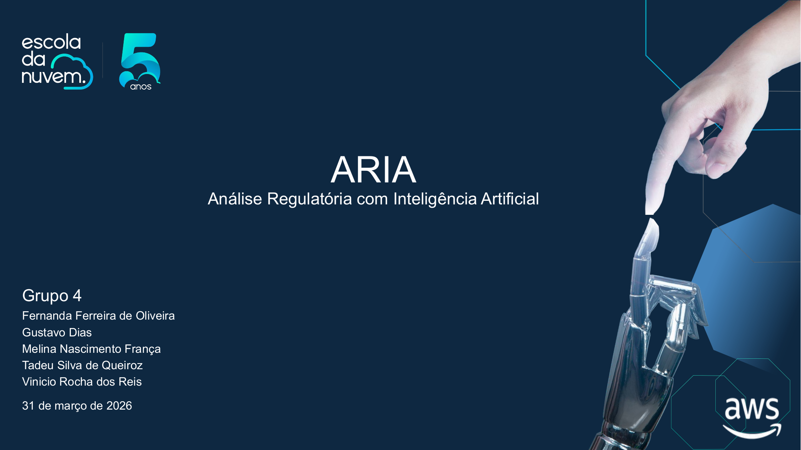
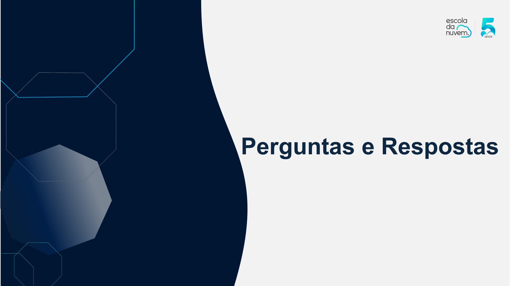
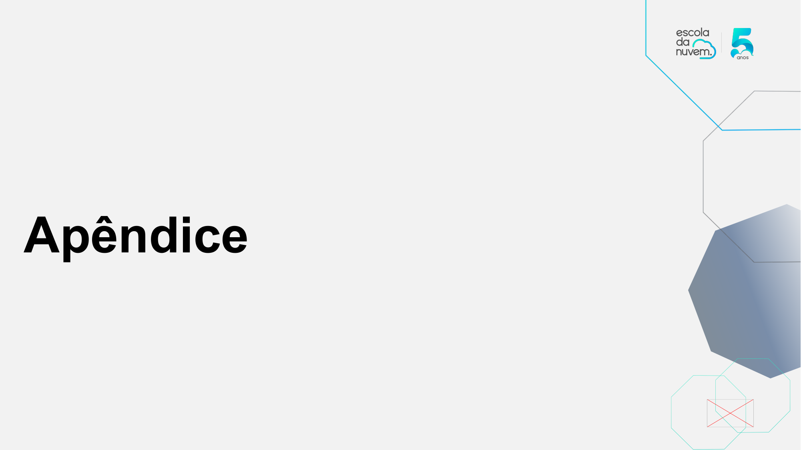
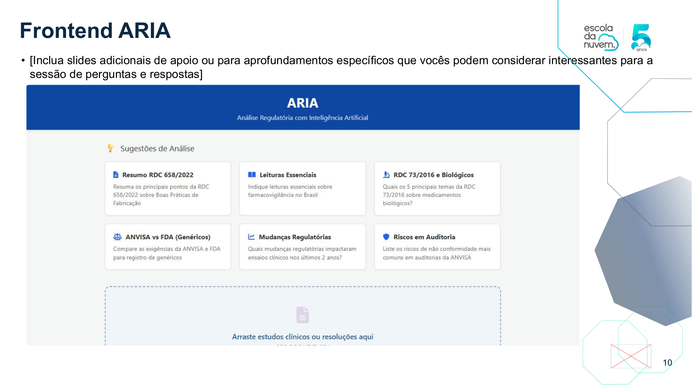
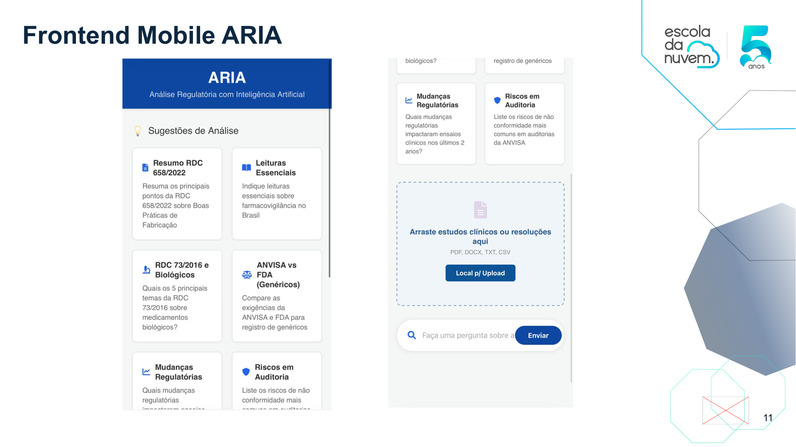
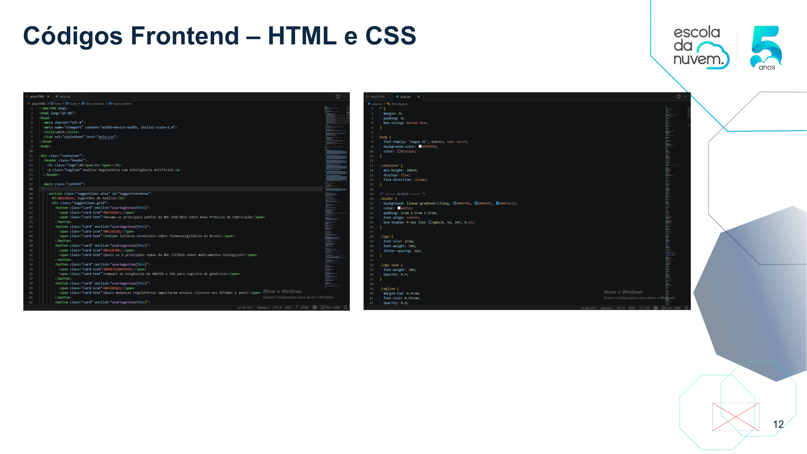
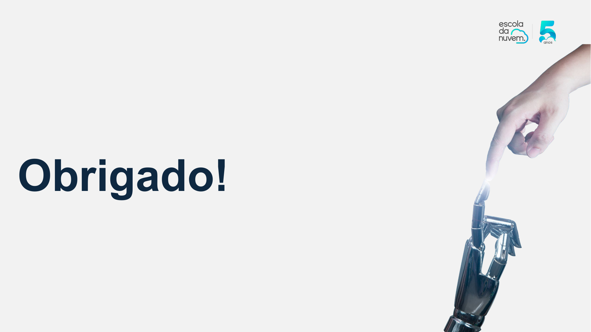

# ARIA | Inteligência Regulatória com IA Generativa 🚀
🥈 2º LUGAR GERAL no Hackathon Talento Tech 3.0 - Escola da Nuvem - Hacking for Good 2026.

Solução: "Extração de Conhecimento em Dados Complexos"

---

## 🌟 Visão Geral do Projeto
Visão Geral da Solução

A ARIA, anteriormente conhecida como PharmaGen Insights, é uma plataforma de Inteligência Regulatória muito avançada...

---

## 👤 O Desafio do Setor (Persona)
"A indústria farmacêutica trabalha com uma grande quantidade de documentos complexos..."

---

## 💡 Transformação na Prática
Endereçamento X Problema

Cenário Tradicional: Analistas dedicam ~15h semanais...
Cenário com ARIA: O sistema realiza a busca ativa...

---

## 🚀 Diferenciais Estratégicos e Técnicos
A ARIA utiliza um pipeline inteligente que garante rastreabilidade total e escalabilidade...

---

## 🏗️ Arquitetura Cloud Native (AWS)
Arquitetura da Solução

Desenhada sob os pilares do AWS Well-Architected Framework...

---

## 📺 Vídeo Demonstração
[Ver vídeo](https://github.com/tadeu-queiroz/aria-analise-regulatoria-genai/raw/main/arquitetura_github.mp4)

---

## 🧪 Validação e Prova de Conceito (PoC)
O sistema foi validado com documentos reais...

---

## 📊 Impacto e Métricas de Sucesso
Principais Benefícios e Medidas de Sucesso

Agilidade, Conformidade, Eficiência, Time-to-Market...

---

## 💰 FinOps e Viabilidade Econômica
Investimento Mensal (PoC): Estimado em $305,18...

---

## 🌿 Compromisso ESG (Hacking for Good)
Alinhada ao pilar de Sustentabilidade...

---

## 🆙 Evolução e Roadmap
Fase 1: Reforço de Segurança...
Fase 2: Otimização de Performance...

---

## 📄 Documentação Técnica
👉 Acessar Apresentação Completa (PDF)

---

## 🤝 Time de Desenvolvimento (Grupo 4)
Equipe Vencedora ARIA

Fernanda Ferreira de Oliveira  
Gustavo Dias Gomes  
Melina Nascimento França  
Tadeu Silva de Queiroz  
Vinicio Rocha dos Reis  

---

## 🏢 Realização e Apoio
Projeto desenvolvido para o Hackathon Talento Tech 3.0 Escola da Nuvem...

Empresas que apoiam esse projeto: Escola da Nuvem, AWS, TD SYNNEX, Dedalus, BRLink, Enkel, Darede, DreamSquad

